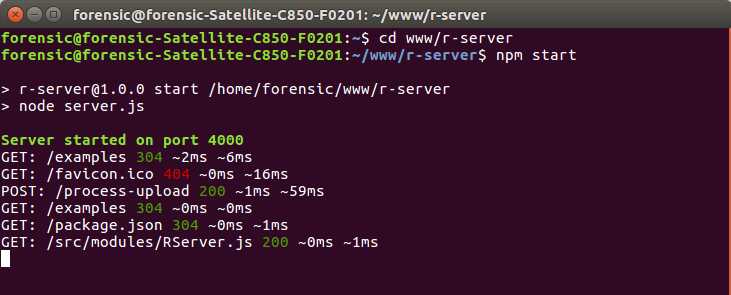

# R-Server

[](https://travis-ci.org/harrison-ifeanyichukwu/r-server)
[](https://coveralls.io/github/harrison-ifeanyichukwu/r-server?branch=master)
[](https://github.com/semantic-release/semantic-release)
[](https://badge.fury.io/js/r-server)


R-Server is a lightweight, fully integrated [node.js](https://nodejs.org/en/docs/guides/anatomy-of-an-http-transaction/) web server, with inbuilt routing engine, static file server, body parser including form-data and file upload handlers, middleware support, request-response profiler, and lots more.

Despite being configurable for advanced usage, it requires no configurations to get started. It is fully compatible with [express.js](https://expressjs.com/) and provides even more functionalities out of the box without the need for external plugins.

## Getting Started (NPM install)

```bash
npm install r-server --save-dev
```

Create a `server.js` file in your project root directory and write the following lines of code.

```javascript
let RServer = require('r-server'),
    app = RServer.instance();

//default port is 4000
app.listen(null, () => {
    console.log('listening');
});

//add get route
app.get('/', (req, res) => {
    res.end('<h1>Welcome, Hello World!!!</h1>');
});
```

**start server**:

```bash
npm start
```

Navigate to `http://localhost:4000/` in your browser to view this mini web project. *It is that simple!*.

## Why R-Server

R-Server gives you many cutting edge, excellent features out of the box, saving you the stress of looking for external plugins and third party solutions. These include:

1. **Excellent Request Body Parser:**

    R-Server has an inbuilt, and excellent control over request body parsing, with ability to handle urlencoded, json-encoded, and multipart form-data including file uploads, requiring no overhead trying to use an external plugin. Multi-value form fields are supported and should be named using [PHP-like](http://php.net/manual/en/tutorial.forms.php) ending bracket notations. e.g `slct-countries[]`, `file-documents[]`.

    The parsed request body data are accessible through `request.body`, parsed files are accessible through `request.files`, while query parameters are accessible through `request.query` . There is a `request.data` that is a combination of both `body` and `query` with values in `body` winning the battle in case of conflicting keys.

    **Demonstrating Parsed Request Data Accessiblities:**

    ```javascript
    let fs = require('fs'),
        RServer = require('r-server'),
        app = RServer.instance();

    //default port is 4000
    app.listen();

    app.post('user/create', (req, res) => {
        //access data
        let name = req.body.name,
            password = req.body.password,

            //access file
            cvDetails = {
                filename: req.files.cv.fileName,
                filesize: req.files.cv.size,
                mimetype: req.files.cv.mimeType,
                path: req.files.cv.path,
                tempName: req.files.cv.tempName,
            };

        //copy the file to a folder
        fs.copyFileSync(cvDetails.path, 'public/cv/something.pdf');

        res.end('Great, user created');
    });
    ```

2. **Excellent Routing Engine:**

    It provides an excellent routing engine, with parameter capturing that incoporates data type enforcement on captured parameters. All http method verbs are made available in the router including `get`, `post`, `put`, `delete`, `options`, `head` and the universal `all` method.

    Unlike express, parameter capturing sections are enclosed in *curly braces {}*  and you are not prevented from using hyphen in your parameter names.

    ```javascript
    app.get('user/{user-id}/profile', (req, res, id) => {
        id = /^\d+$/.test(id)? Number.parseInt(id) : 0;

        if (id !== 0)
            res.end('Cool, user id is valid!!!');
        else
            res.end('<h1>Invalid user id found</h1>');
    });

    //save stress, type hint parameter data type
    app.route('user/{int:user-id}/profile', (req, res, id) => {
        //id is already an integer. 0 for NaN
        if (id !== 0)
            res.end('<h1>Your profile is not ready yet');
        else
            res.end('<h1>Invalid user id found</h1>');
    });
    ```

    It also supports chainable routing through the `route` method.

    ```javascript
    app.route('auth/login')
        .get((req, res) => {

        });
        .post((req, res) => {

        });
    ```

3. **Excellent Static File Server:**

    It provides static file services out of the box, responding to `GET`, `HEAD`, & `OPTIONS` requests made on such files. By default, it serves files from the project's root directory and also from the `./public` folder. *It does not serve config files (files that starts with dot `.`)*.

    The list of Default documents includes only 'index.html'. See [configuring-rserver](#configuring-rserver) on how to configure the list of default documents and so many other options.

    It uses node.js inbuilt [writable & readable stream API](https://nodejs.org/api/stream.html#stream_class_stream_writable) while serving files for performance gain, user experience and minimal usage of system resources.

    It provides excellent content negotiation [headers](https://www.w3.org/Protocols/rfc2616/rfc2616-sec14.html) (`Cache-Control`, `ETag` & `Last-Modified` headers) and would negotiate contents by checking for the presence of the  `if-none-match` & `if-modified-since` http request headers.

4. **Middleware Support:**

    It supports middleware usage through the `use` method and this makes it extensible. The middleware must be a `callable` (function).

    ```javascript
    app.use((req, res, next) => {
        //do some things
        ....

        if (req.method !== 'POST')
            next();
        else
            res.end('wrong method');
    });
    ```

5. **Mountable mini-app Router:**

    It gives you the same feature that `express.Router()` offers, with additional ability to specify if the mini app router should inherit the main app's middleware when it gets mounted.

    **call signature:**

    ```javascript
    // inherit middlewares defaults to true
    RServer.Router(inheritMiddlewares?);
    ```

    **usage sample:**

    ```javascript
    //file routes/auth.js
    let rServer = require('r-server'),
        router = rServer.Router(false);

    router.use((req , res, next) => {
        next();
    });

    router.get('/login', (req, res) => {});
    router.post('/login', (rq, res) => {});

    router.route('signup')
        .get((req, res) => {})
        .post((req, res) => {});

    module.exports = router;
    ```

    **import to main app:**

    ```javascript
    //file app.js
    let rServer = require('r-server'),
        authRouter = require('routes/auth.js'),
        app = rServer.instance();

    app.listen();

    app.mount('auth', router);

    //this middleware will not affect
    //auth routes, as the router
    //specified inherit middleware as false
    app.use((req , res, next) => {
        next();
    });

    router.get('/', (req, res) => {});
    router.post('/user/{int:userId}/profile', (rq, res) => {});
    ```

6. **Request-Response Profiler:**

    It outputs a command line profile log for all incoming requests, loging the request's method, request url, response status code, request duration and response duration. This gives a performance insight of the project.

    []

7. **Availability of Some Utility Methods:**

    There are also some utility methods made available on the response object, such as download method, which can be used to send a download atachment back to the client. Unlike in `express`, the file path should be relative to the project's root directory.

    ```javascript
    app.get('downloads/{int:resId}', (req, res, fileId) => {
        if (fileId)
            res.download('files/document-' + fileId + '.pdf');
        else
            res.end('File does not exist');
    })
    ```

    The full call signature is:

    ```javascript
    response.download(filePath, filename, callback);
    ```

8. **Ability to Define Custom HTTP Error Documents:**

RServer is configurable, and allows the ability to define custom http error files that are mapped to http error codes such as [404](https://developer.mozilla.org/en-US/docs/Web/HTTP/Status/404), etc. This is achieved by defining a `httpErrors` entry in your config file. See [Configuring RServer](#configuring-rserver) for details.

## Configuring RServer

RServer uses an internal `.rsvrc.json` file that defines default server configurations for your project. the full config options is as shown below:

```json
{
    "tempDir": "storage/temp",

    "staticFileDir": ["/", "/public"],

    "cacheControl": "no-cache, max-age=86400",

    "encoding": "latin1",

    "maxBufferSize": 50000000,

    "mimeTypes": {
        "json": "application/json",
        "html": "text/html",
        "xml": "text/xml",
        "js": "text/javascript",
        "css": "text/css",
        "jpg": "image/jpeg",
        "jpeg": "image/jpeg",
        "png": "image/png",
        "mp3": "audio/mp3",
        "mp4": "video/mp4",
        "pdf": "application/pdf"
    },

    "defaultDocuments": [
        "index.html"
    ],

    "httpErrors": {
        "baseDir": "",
        "404": ""
    }
}
```

You can override these options by creating and placing a `.rsvrc.json` file in your project's root directory. You can even name it any other thing or place it anywhere provided you supply the file's relative path when creating an instance, like below:

```javascript
let rServer = require('r-server'),
    app = rServer.instance(configPath),
    app2 = rServer.instance(configPath2);

    app.listen(4000);
    app2.listen(9000);

    app.get('/', (req, res) => {
        res.end('This is app on port 4000');
    });

    app2.get('/', (req, res) => {
        res.end('This is app2 on port 9000');
    });
```

The two instances above are separate, knows nothing about each other and each uses its own config file.

### Config Options Explained

- **tempDir**: defines the relative path to your project's temp directory, while uploaded files gets stored temporary for the duration of a request.

- **staticFileDir**: defines the relative path(s) from where to serve out static files. Note that it does not serve out files starting with dot character.

- **cacheControl**: defines cache-control header to use when negotiating static files.

- **encoding**: defines the encoding used by your project. This should not be overriden.

- **maxBufferSize**: defines the maximum buffer that a given request can send to the server. If it exceeds this setting, the request will be terminated for security reasons.

- **mimeTypes**: defines a list of file extension to their mime type map. You should not override this. More mime types are will be included, and you can help us out by increasing the list.

- **defaultDocuments**: defines a list of default documents that should be served when a request points to a folder in one of the defined static file directories.

- **httpErrors**: defines a custom map of http error documents that should be served by the web server for http server errors. The base directory is a relative path that is defined to ease you from repeating the same relative path multiple times.

## Contributing

We welcome your own contributions, ranging from code refactoring, documentation improvements, new feature implementations, bugs/issues reporting, etc. we recommend you follow the steps below to actively contribute to this project:

1. Having decided on what to help us with, fork this repository

    npm install packages:

    ```bash
    npm install
    ```

2. Implement your ideas

    Implement your code reviews, changes, features, following the [laid out convention](CONTRIBUTING.md),

3. Create a pull request, explaining your improvements/features

All future contributors will be included below and immensely appreciated. We look forward to your contributions.

## About Project Maintainers

This project is maintained by [harrison ifeanyichukwu](mailto:harrisonifeanyichukwu@gmail.com), a young, passionate full stack web developer, an [MDN](https://developer.mozilla.org/en-US/profiles/harrison-feanyichukwu) documentator, maintainer of w3c [xml-serializer](https://www.npmjs.com/package/@harrison-ifeanyichukwu/xml-serializer) project, node.js [Rollup-All](https://www.npmjs.com/package/r-server) plugin and other amazing projects.

He is available for hire, ready to work on amazing `PHP`,  `Node.js`,  `React`,  `Angular`,  `HTML5`,  `CSS` and database projects. Looks forward to hearing from you soon!!!